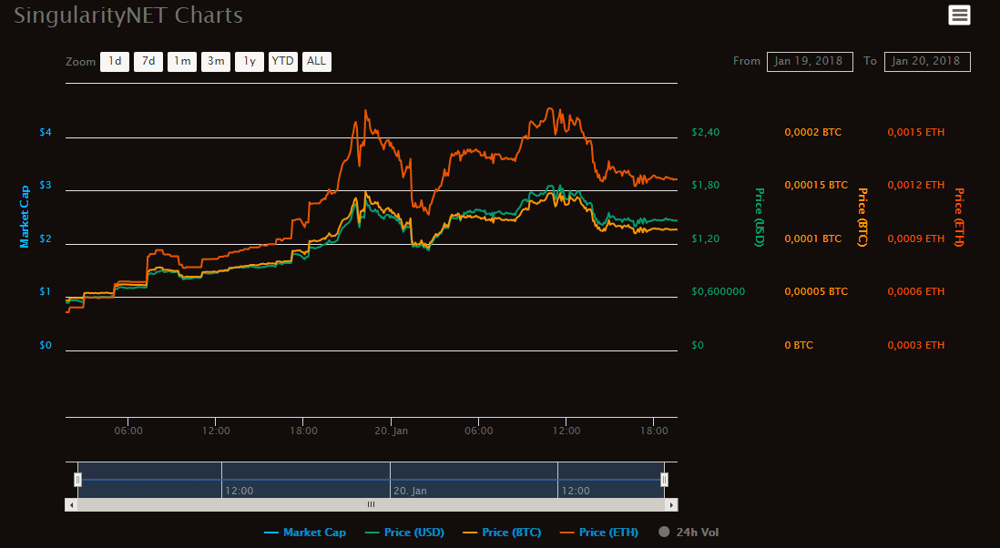

# Meeting on 19/01/2018 (majority)

## Ethereum: Distributive Apps and Distributive Thoughts

Обсуждали конструкцию распределённых приложений и зачем вообще блокчейн. Т.е. почему криптокотики это смартконтракты, а не записи в классической базе данных. Вопрос во многом социологический и связан с ощущением автономности обладания и чувством собственности, плюс хайп. Чего больше? по-ровну.

Затрагивали вопрос обеспеченности биткоинов и то как происходит связка с "реальными" деньгами. Этот вопрос также вводит в тему токен-экономик, т.к. в какой момент токены приобретают ценность и как это происходит.

Был интерес к самому протоколу Эфира на самом низком уровне и заинтересовала возможность написания кода внутри биткоин транзакций. Насколько [EVM](https://github.com/pirapira/awesome-ethereum-virtual-machine) и смартконтракты Эфира богаче [фортоподобного языка](https://en.bitcoin.it/wiki/Script) в биткоине.

Коснулись [форка своих чейнов](https://www.google.com.cy/search?q=ethereum+creating+private+chains) в Эфире ([пример конфига мастер ветки](https://github.com/Apress/introducing-ethereum-solidity/blob/master/Introducing-Ethereum-and-Solidity-master/genesis765.json)).

[DAO. Decentralized Autonomous Organization](https://www.ethereum.org/dao). Какой в ней реальный смысл и нужно ли в Эфире демократия. Как использовать голосования для управления, чем управлять? посеим ли мы хаос давая возможность всем голосовать. Мнения разделились - а) голосовать нужно только тем, кто знает, б) голосовать можно, всем но не за значимые решения.

Прозвучала занятная идея о том что биткоин вечен, т.к. фактически если у нас что-то не так, мы форкаем ветку битка и называем его Bitcoin Gold, что-то улучшаем и называем Bitcoin Cash, ещё улучшаем и т.д. и т.д. и т.д.. Сложно поспорить)

Был вопрос - как с помощью эфира, своих чейнов или ещё каким либо способом обеспечить переводы без комисий.

Вспомнили криптокотят, а не сделать ли нам криптопорно?

Форекс. Арбитраж.

# TODO

* форкнуть свою ветку и сделать следующее.

  хранить в общей ветке эфира в своём смартконтракте в map:
  [mapping](http://solidity.readthedocs.io/en/develop/types.html#mappings)(address => address) public addrs - адрес объекта во второй своей ветке эфира. а уже в нём весь весомый объект.

  совем дубовый пример - организовать хранение клипов в эфирном блокчейне на своей ветке, а названия хранить в основном

# идея

* любовь для криптокотят. Можно своих криптокотиков занять любовь и этот процесс собственно будет визуализирован. Вообщем приобретать любовные сцены для криптокотят. Криптопорно? Еее!

# Q to ask:
* приложения на ropsten
* совпадающие адреса в тестнете и в мейн сетке эфира
* встречались ли примеры когда токены вначале выпускались в тестнете и вся токен эконимика происходила в нём
* если ли специализация тестнетов
* каково максимальное количество токенов?
* возможно ли бесконечная эмиссия или же тогда не имеет смысла им торговать
* с другой стороны если токен обеспечен платежами то бесконечная эмиссия возможна
* токены за тьюзы в [TuSion](http://tusion.xyz)
* всё же - что делать со случаем когда-то токены куплены одной персоной ( а далее все токены утеряны )
* верно ли что в идеале для работы с токенами по хорошему надо использовать DAO
* http://etherlisten.com/ когда здесь пролетают функции - значит ли что кто-то их вызывает?

# links:

* [Omni Layer: An open-source, fully decentralized asset platform on the Bitcoin Blockchain](http://www.omnilayer.org/)

# to see

* спасибо Мише за видео по Solidity [Ethereum Foundation Developers Conference: DevCon Day3](https://www.youtube.com/watch?v=k42YNyvG8CU&feature=youtu.be&t=35s)

# news

 * [singularitynet - AGI](https://singularitynet.io/) сделали [ICO за день](https://coinmarketcap.com/currencies/singularitynet/) ровно как и 12x по своим токенам. Кстати в команде у них [Алексей Потапов](https://scholar.google.com/citations?user=pBIU5fcAAAAJ&hl=ru&oi=ao).
 

# stats

Cryptocurrencies: 1469 / Markets: 7823

Market Cap: $636 161 835 999 / 24h Vol: $35 504 043 406 / BTC Dominance: 34.5%
